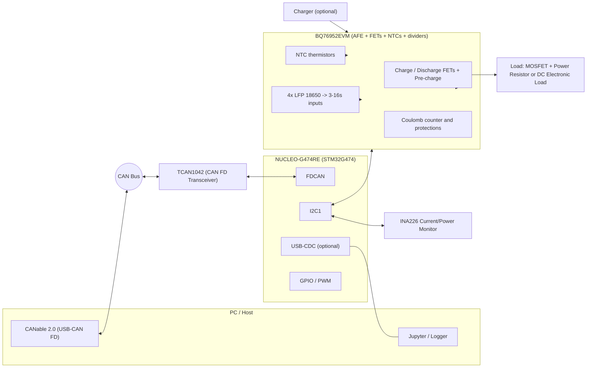
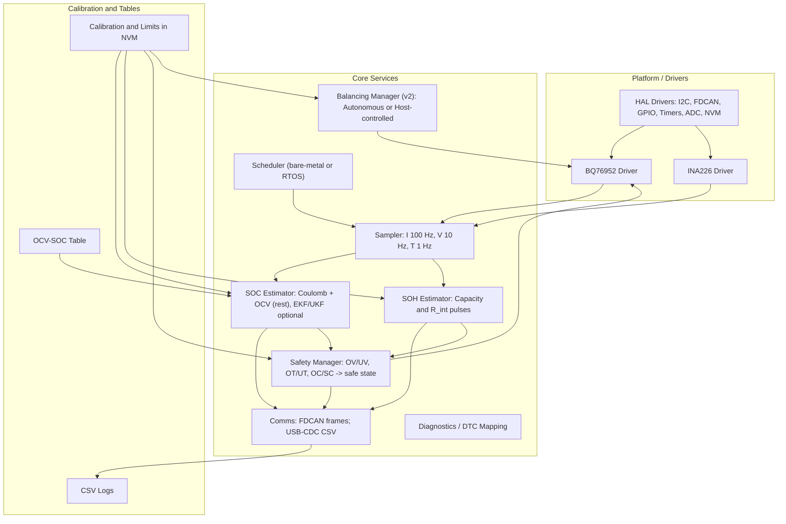

# BMS Training Demo — Option A1 Diagrams (Fixed Mermaid)

This document contains the **System Diagram** for **Option A1** (STM32 + TCAN1042 + BQ76952EVM + INA226) and the **Software Architecture Diagram** for the training platform.

> **Note:** To maximize compatibility with GitHub’s Mermaid renderer, this version avoids non‑ASCII punctuation, HTML line breaks, and edges that target subgraph IDs.

---

## 1) System Diagram — Option A1 (GitHub‑compatible Mermaid)



**Signals & Interfaces**
- **I2C1** <-> **BQ76952EVM** (cell voltages, temperatures, coulomb counter, commands)  
- **I2C1** <-> **INA226** (pack current and bus voltage)  
- **FDCAN** <-> **TCAN1042** <-> **CANable/PC** (telemetry, DTCs, control)  
- **USB-CDC** (optional) for CSV logging / firmware debug  
- **Cells/NTCs** wired to the **EVM**; **FETs/pre-charge** drive the **load/charger**

---

## 2) Software Architecture Diagram (GitHub‑compatible Mermaid)



---

## 3) ASCII Fallback (System)

```
 PC/Jupyter  --USB-->  CANable  == CAN ==  TCAN1042  <== FDCAN ==>  STM32G474 (NUCLEO)
                                          |
                                I2C1 <----+---->  BQ76952EVM (cells, NTCs, FETs, coulomb)
                                I2C1 <---------->  INA226 (shunt)
 Cells/NTCs --> BQ76952EVM --> FETs/Precharge --> Load / Charger
 USB-CDC (optional) <------> PC Logger
```
