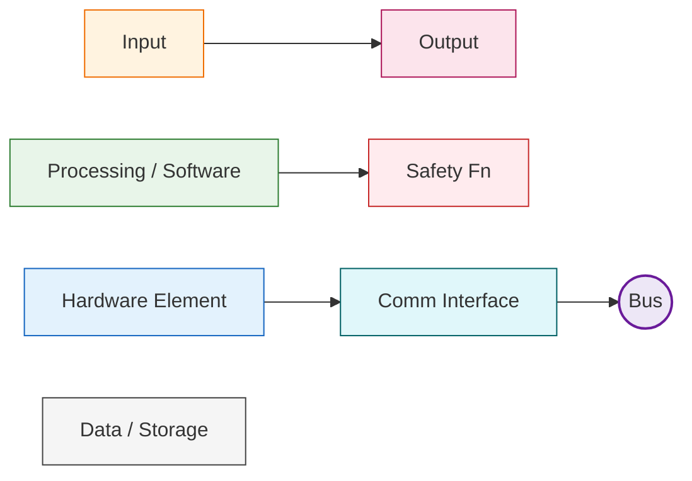
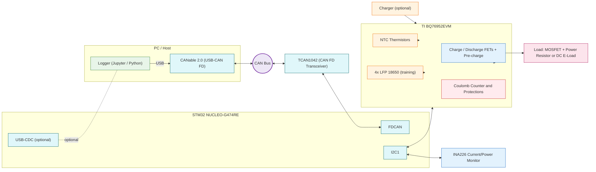
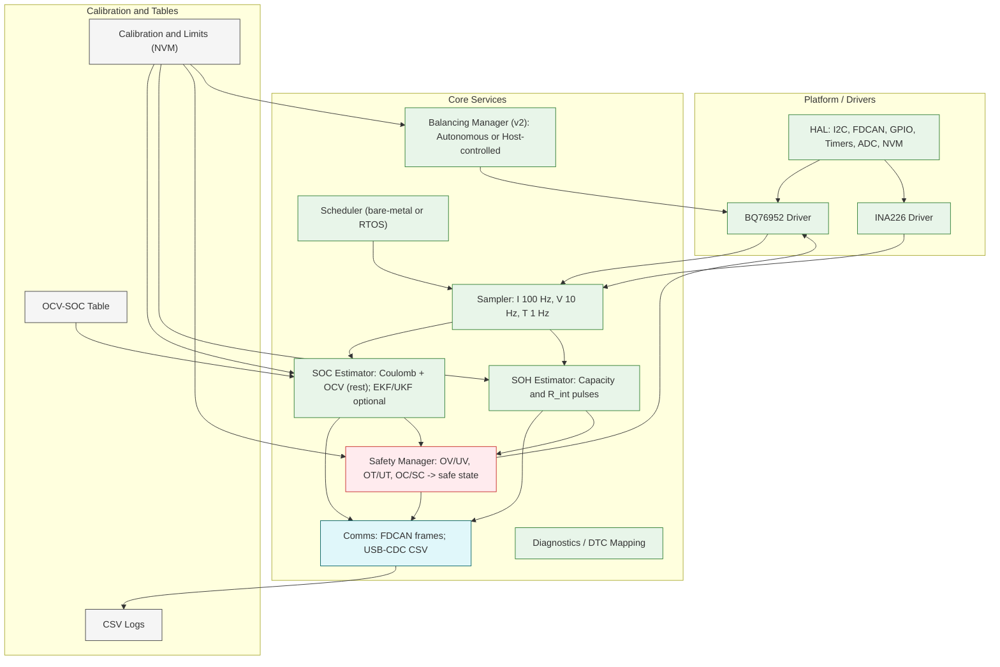

# BMS Training Demo — Option A1 (Enhanced Diagrams)

These diagrams are styled for clarity and next‑step execution. Colors differentiate **inputs**, **outputs**, **processing/software**, **hardware elements**, **communications**, **bus**, **safety**, and **data/storage**. Render in any Mermaid‑enabled Markdown viewer (e.g., GitHub).

---

## Legend

---

## 1) System Diagram — Option A1 (STM32 + TCAN1042 + BQ76952EVM + INA226)

**Key notes**
- **I2C1** links the MCU to **BQ76952EVM** and **INA226** for measurement/control.  
- **FDCAN → TCAN1042 → CANable → PC** forms the telemetry and control path.  
- **Safety** actions (OV/UV/OT/OC/SC) are primarily enforced in the AFE (**CC** block).

---

## 2) Software Architecture — Training Scope

**Reading the colors**
- **Green** = algorithms/services; **Blue** = hardware elements; **Cyan** = comms; **Orange** inputs; **Rose** outputs; **Red** safety; **Gray** storage/calibration.

---

## 3) Suggested Next Steps (from these diagrams)

1. **Bring-up:** verify I2C comms to **BQ76952EVM** and **INA226**; stream raw frames over **FDCAN**.  
2. **Sampler timing:** lock **100 Hz** (current), **10 Hz** (cell V), **1 Hz** (temps).  
3. **SOC v1:** coulomb counting + rest‑only OCV correction; CSV logs for replay.  
4. **SOH v1:** current‑pulse **R_int**; cycle‑based capacity tracking.  
5. **Safety thresholds:** configure OV/UV/OT/OC/SC; validate **safe state** (open FETs).  
6. **Balancing (v2):** top‑of‑charge bleed with hysteresis and idle guards.

