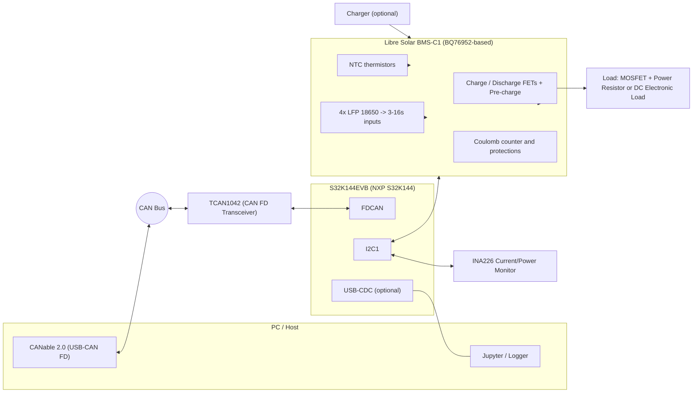
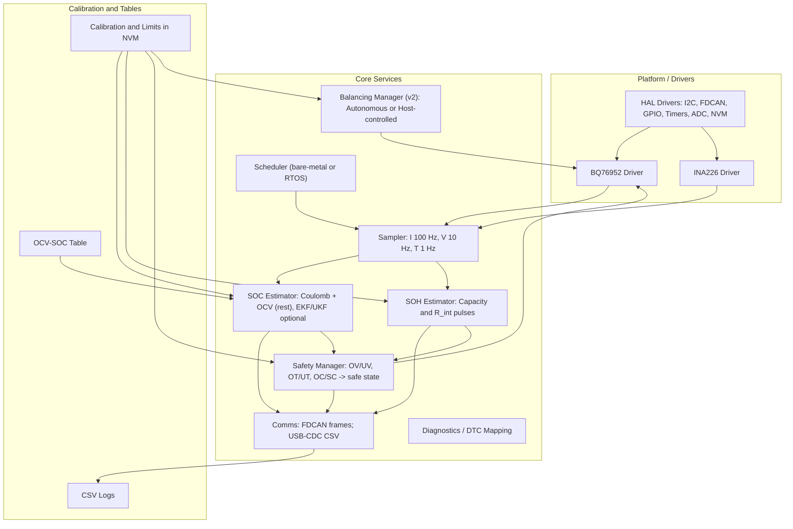

# BMS Training Demo — Option B2 Diagrams (GitHub-compatible Mermaid)

This document contains the **System Diagram** for **Option B2** (NXP S32K144EVB + TCAN1042 + Libre Solar BMS‑C1 + INA226) and the **Software Architecture Diagram** for the training platform.

---

## 1) System Diagram — Option B2



**Signals & Interfaces**
- **I2C1** <-> **BMS‑C1** (BQ76952 driver: cell voltages, temperatures, coulomb counter, commands)  
- **I2C1** <-> **INA226** (pack current and bus voltage)  
- **FDCAN** <-> **TCAN1042** <-> **CANable/PC** (telemetry, DTCs, control)  
- **USB‑CDC** (optional) for CSV logging / firmware debug  
- **Cells/NTCs** wired to the **BMS‑C1**; **FETs/pre‑charge** drive the **load/charger**

---

## 2) Software Architecture Diagram



---

## 3) ASCII Fallback (System)

```
 PC/Jupyter  --USB-->  CANable  == CAN ==  TCAN1042  <== FDCAN ==>  S32K144EVB (NXP S32K144)
                                          |
                                I2C1 <----+---->  Libre Solar BMS-C1 (BQ76952)
                                I2C1 <---------->  INA226 (shunt)
 Cells/NTCs --> BMS-C1 --> FETs/Precharge --> Load / Charger
 USB-CDC (optional) <------> PC Logger
```
