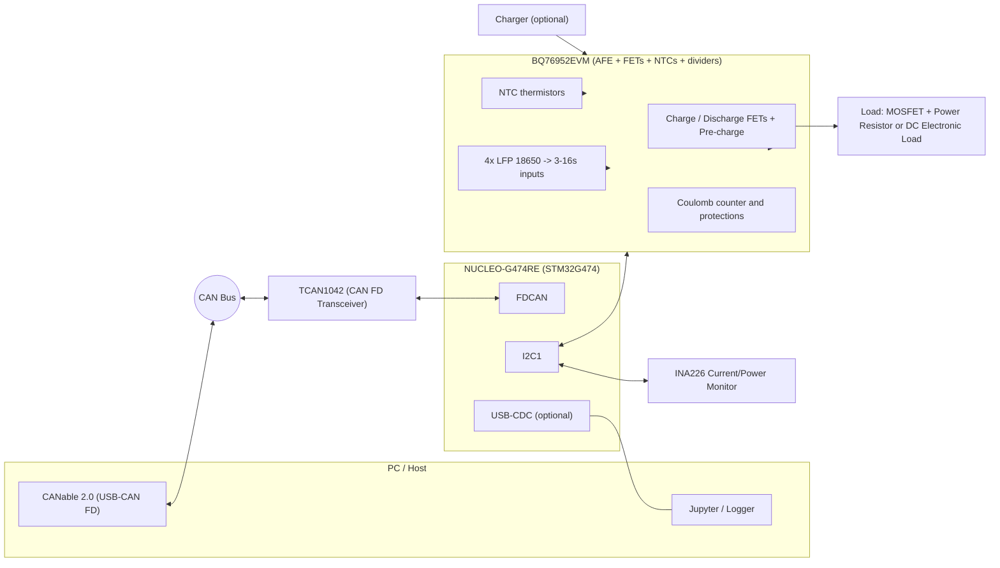
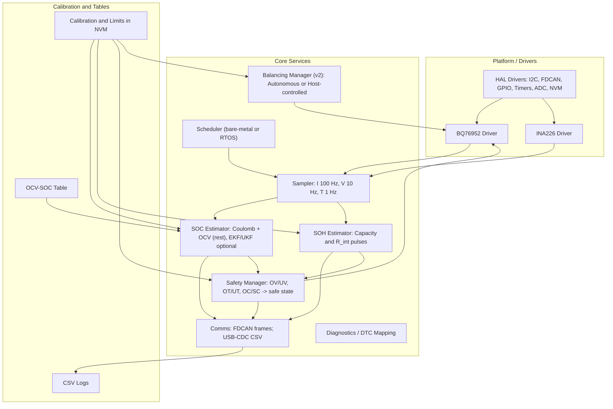
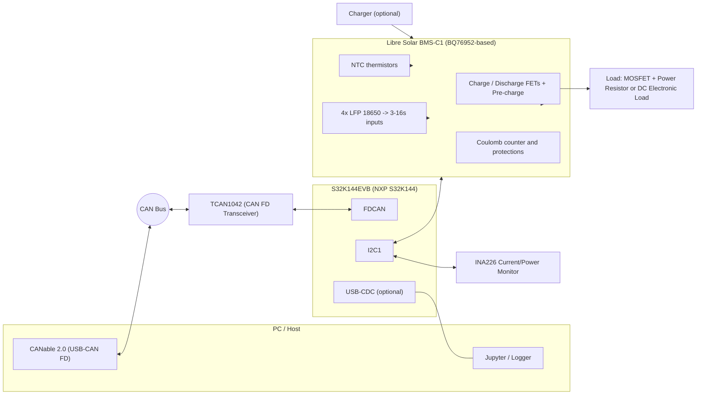

# BMS Training Demo Platform — SOC & SOH (Consolidated)

> **Purpose:** A compact, low-cost training platform to implement and evaluate **State of Charge (SOC)** and **State of Health (SOH)** on a safe, bench‑top battery system. Scales to balancing (passive → active) and teaches ISO 26262‑friendly habits.

---

## Table of Contents
- [1) What We’re Building (v1 Goals)](#1-what-were-building-v1-goals)
- [2) Recommended Hardware (Low Cost, Expandable)](#2-recommended-hardware-low-cost-expandable)
  - [A. Core Controller & Comms (two options)](#a-core-controller--comms-two-options)
  - [B. Cell Monitoring & Balancing](#b-cell-monitoring--balancing)
  - [C. Pack Current & Temperature Sensing](#c-pack-current--temperature-sensing)
  - [D. Safe Bench Energy & Loads](#d-safe-bench-energy--loads)
- [3) Development Environment (Free, Robust)](#3-development-environment-free-robust)
- [4) Software Architecture (Teaching-Oriented, Safety-Aware)](#4-software-architecture-teaching-oriented-safety-aware)
- [5) BOM & Cost Comparison](#5-bom--cost-comparison)
- [6) Bring-up Plan (Safe & Fast)](#6-bring-up-plan-safe--fast)
- [7) Expansion Roadmap](#7-expansion-roadmap)
- [8) Practical ISO 26262-Friendly Habits](#8-practical-iso26262-friendly-habits)
- [9) Diagrams (All Options)](#9-diagrams-all-options)
  - [9.1 Option A1 — System](#91-option-a1--system)
  - [9.2 Option A1 — Software](#92-option-a1--software)
  - [9.3 Option A2 — System](#93-option-a2--system)
  - [9.4 Option A2 — Software](#94-option-a2--software)
  - [9.5 Option B1 — System](#95-option-b1--system)
  - [9.6 Option B1 — Software](#96-option-b1--software)
  - [9.7 Option B2 — System](#97-option-b2--system)
  - [9.8 Option B2 — Software](#98-option-b2--software)
  - [9.9 ASCII Fallback (System)](#99-ascii-fallback-system)
- [References & Useful Links](#references--useful-links)
- [Appendix: Abbreviations](#appendix-abbreviations)

---

## 1) What We’re Building (v1 Goals)

**Target use.** Hands-on training for **SOC** (coulomb counting + OCV correction) and **SOH** (capacity + impedance) on a safe, low-voltage pack (**4‑cell LFP** recommended).

**Cost bias.** Favor affordable, widely available parts; lean on open-source where possible.

**Scalability.** The stack should scale to **12–16 cells** and add **passive (v2)** and optional **active (v3)** balancing.

**Safety mindset.** Bench‑top, fused, current‑limited; separate safety vs non‑safety software (**QM** level for training).

---

## 2) Recommended Hardware (Low Cost, Expandable)

### A. Core Controller & Comms (two options)

**Option A — Lowest cost, rich analog (STM32):**

| Item | Recommendation | Notes |
|---|---|---|
| **MCU board** | **ST NUCLEO-G474RE** (Cortex‑M4F, FDCAN, op-amps/comparators) | Board price ≈ **US$22** (e.g., Newark). |
| **CAN transceiver** | **TI TCAN1042** (CAN‑FD) | Vendors: TI, Mouser, etc. |
| **USB‑CAN to PC** | **CANable 2.0** (open‑source) | ≈ **US$35** retail; clones ~**US$19**. |

**Option B — ISO‑oriented MCU family (NXP):**

| Item | Recommendation | Notes |
|---|---|---|
| **MCU board** | **NXP S32K144EVB** (ASIL‑B family; CAN‑FD) | EVB typically **US$49–$112** depending on channel. |
| **Tooling note** | **S32K family** | ISO 26262 up to ASIL‑B; safety‑ready **RTD** drivers. |

> **Choose A** for absolute cost savings. **Choose B** if training emphasizes ISO work products and tooling.

---

### B. Cell Monitoring & Balancing

| Item | Recommendation | Notes |
|---|---|---|
| **Battery monitor AFE** | **TI BQ76952** (3–16s) | High‑accuracy cell voltage, **passive balancing**, integrated **coulomb counter**. |
| **Open HW board** | **Libre Solar BMS‑C1** | BQ76952‑based; 3–16s; CAN; passive balancing; detailed manual + BOM. |
| **Turnkey EVM** | **TI BQ76952EVM** | Complete board with FETs/NTCs; pricier; includes divider‑based cell simulator. |

---

### C. Pack Current & Temperature Sensing

| Function | Recommendation | Notes |
|---|---|---|
| **Current** | **TI INA226** + low‑ohm shunt | Ideal for coulomb counting and load profiling. |
| **Redundancy** | Use **BQ76952** coulomb counter too | Demonstrates calibration & cross‑checks. |
| **Temperature** | **10 kΩ NTCs** | BQ76952 supports up to nine externals. |

---

### D. Safe Bench Energy & Loads

- **Cells:** **4× LFP 18650** in holders (12.8 V nominal) + **10 A fuse** near pack positive.  
- **No‑battery bring‑up:** **Resistor‑divider cell simulator** (or EVM’s built‑in dividers).  
- **Load:** MOSFET + power resistor (or a small DC electronic load) for **R_int** pulse tests.

---

## 3) Development Environment (Free, Robust)

| Layer | Recommendation | Notes |
|---|---|---|
| **Firmware IDE (STM32)** | **STM32CubeIDE** + HAL | Free; FDCAN + I2C/SPI. |
| **Firmware IDE (NXP)** | **S32 Design Studio** + **RTD** | AUTOSAR / non‑AUTOSAR; ISO‑friendly. |
| **PC tools** | **Python + Jupyter**, **PyBaMM** | Logging/plotting; physics‑based sim & OCV curves. |
| **Datasets** | **NASA PCoE**, **CALCE** | Offline SOC/SOH estimator tuning. |
| **CAN on PC** | **CANable 2.0** + can‑utils/Wireshark | SocketCAN (gs_usb). |

---

## 4) Software Architecture (Teaching-Oriented, Safety-Aware)

- **Drivers/HAL:** BQ76952 (I2C/SPI), INA226 (I2C), FDCAN, GPIO, timers, NVM.  
- **Sampler:** Current **100 Hz**; per‑cell voltage **10 Hz**; temps **1 Hz**.  
- **SOC estimator:** Coulomb counting (primary) + **OCV‑SOC** correction at rest; optional **EKF/UKF**.  
- **SOH estimator:** Capacity from cycles; **R_int** from current‑pulse ΔV/ΔI windows.  
- **Balancing manager (v2):** Top‑of‑charge bleed with hysteresis, idle guards, min cell V.  
- **Safety manager:** OV/UV/OT/UT/OC/SC → **open FETs** / inhibit charge.  
- **Comms + logging:** FDCAN frames (cells, pack, SOC, SOH, faults), USB‑CDC CSV.

---

## 5) BOM & Cost Comparison

### Subtotals (electronics, excl. tools; indicative)
| Option | Stack | Est. Subtotal |
|---|---|---|
| **A1** | STM32 + **BQ76952EVM** + INA226 + CANable + TCAN1042 + 4×LFP + bits | **$407–$430** |
| **A2** | STM32 + **Libre Solar BMS‑C1** (DIY) + INA226 + CANable + TCAN1042 + 4×LFP + bits | **$190–$250** |
| **B1** | S32K144EVB + **BQ76952EVM** + INA226 + CANable + TCAN1042 + 4×LFP + bits | **$497–$520** |
| **B2** | S32K144EVB + **Libre Solar BMS‑C1** (DIY) + INA226 + CANable + TCAN1042 + 4×LFP + bits | **$270–$330** |

**Interpretation**
- **DIY (BMS‑C1)** slashes cost but needs PCB fab/assembly time.  
- **EVM** buys plug‑and‑play (FETs/NTCs/dividers) at higher cost.  
- **S32K (B‑options)** aligns better with ISO process training; pricier than STM32 path.

---

## 6) Bring-up Plan (Safe & Fast)

1. **Bench/no‑battery:** I2C to **BQ76952** and **INA226** with divider simulator; verify readings.  
2. **SOC v1:** Coulomb counting @ **100 Hz** + rest‑only OCV correction; CSV logs.  
3. **SOH v1:** **R_int** pulses; capacity tracking on deep cycles.  
4. **Safety:** Configure OV/UV/OT/UT/OC/SC; validate **safe state** (open FETs).  
5. **Real 4S LFP:** Fuse & current limits; compare INA226 vs BQ76952 counters; temp effects.

---

## 7) Expansion Roadmap

- **v2:** 12–16s + **passive balancing** (autonomous/host), top‑of‑charge or long‑idle strategy.  
- **v3:** **Active balancing** modules (e.g., LTC3300‑1) for advanced coursework.  
- **v4:** ISO‑style platform: S32K + safety SBC, redundant current sense, brownout/clock monitors, DTC reporting.

---

## 8) Practical ISO 26262-Friendly Habits

- **Hazards (bench scope).** Thermal (use LFP, fusing, current limits), shorts (fast cutoff via AFE), wiring errors (keyed connectors).  
- **Mechanisms.** Independent OC/SC in AFE; range/rate plausibility; watchdogs; **safe state = open FETs**.  
- **Verification.** Unit tests; **golden log replays** (NASA/CALCE); HIL with cell‑sim harness.

---

## 9) Diagrams (All Options)

### 9.1 Option A1 — System


### 9.2 Option A1 — Software


### 9.3 Option A2 — System


### 9.4 Option A2 — Software


### 9.5 Option B1 — System


### 9.6 Option B1 — Software


### 9.7 Option B2 — System


### 9.8 Option B2 — Software


### 9.9 ASCII Fallback (System)
```
 PC/Jupyter  --USB-->  CANable  == CAN ==  TCAN1042  <== FDCAN ==>  MCU (NUCLEO-G474RE or S32K144EVB)
                                          |
                                I2C1 <----+---->  BQ76952EVM or Libre Solar BMS-C1
                                I2C1 <---------->  INA226 (shunt)
  Cells/NTCs --> AFE/BMS-C1 --> FETs/Precharge --> Load / Charger
  USB-CDC (optional) <------> PC Logger
```

---

## References & Useful Links

### Core controller & comms
- ST **NUCLEO‑G474RE** product page — STMicroelectronics: https://www.st.com/en/evaluation-tools/nucleo-g474re.html
- NXP **S32K144EVB** product page — NXP Semiconductors: https://www.nxp.com/part/S32K144EVB-Q100
- TI **TCAN1042‑Q1** CAN FD transceiver: https://www.ti.com/product/TCAN1042-Q1
- **CANable 2.0** (Openlight Labs store): https://openlightlabs.com/products/canable-2-0
- **CANable** docs/getting started: https://canable.io/getting-started.html

### Cell monitoring & balancing
- TI **BQ76952** (3–16s battery monitor & protector): https://www.ti.com/product/BQ76952
- TI **BQ76952EVM** evaluation module: https://www.ti.com/tool/BQ76952EVM
- Libre Solar **BMS‑C1** hardware (open source): https://github.com/LibreSolar/bms-c1
- Libre Solar **BMS‑C1** user manual: https://libre.solar/bms-c1/manual/

### Current & temperature sensing
- TI **INA226** current/power monitor: https://www.ti.com/product/INA226
- Automotive **INA226‑Q1** variant: https://www.ti.com/product/INA226-Q1

### Development environment
- **STM32CubeIDE** (free IDE): https://www.st.com/en/development-tools/stm32cubeide.html
- **S32 Design Studio (S32DS)**: https://www.nxp.com/design/design-center/software/automotive-software-and-tools/s32-design-studio-ide/s32-design-studio-for-s32-platform:AS32DS-S32PLATFORM

### PC tools (logging, comms, analysis)
- **PyBaMM** battery modeling (homepage): https://pybamm.org/
- PyBaMM paper (Journal of Open Research Software): https://openresearchsoftware.metajnl.com/articles/10.5334/jors.309
- **can-utils** (SocketCAN tools): https://github.com/linux-can/can-utils
- **candleLight_fw** (gs_usb‑compatible firmware for CANable/CANtact): https://github.com/candle-usb/candleLight_fw
- **gs_usb** interface docs for python‑can: https://python-can.readthedocs.io/en/stable/interfaces/gs_usb.html
- **Wireshark** download: https://www.wireshark.org/download.html

### Open datasets for SOC/SOH R&D
- **NASA Prognostics Data Repository (PCoE)**: https://www.nasa.gov/intelligent-systems-division/discovery-and-systems-health/pcoe/pcoe-data-set-repository/
- NASA “**Randomized & Recommissioned Battery Dataset**”: https://data.nasa.gov/dataset/randomized-and-recommissioned-battery-dataset
- **CALCE** (University of Maryland) battery datasets hub: https://calce.umd.edu/battery-data

### Algorithm reviews & references (SOC/SOH, OCV pitfalls)
- Review — SOC estimation methods (MDPI, 2025): https://www.mdpi.com/2032-6653/16/2/87
- Review — SOC/ SOH estimation survey (MDPI, 2024): https://www.mdpi.com/2313-0105/10/1/34
- Review — OCV/SOC modeling comparisons (SpringerOpen): https://cjme.springeropen.com/articles/10.1186/s10033-018-0268-8
- LFP OCV flat‑region discussion (Zitara, 2024): https://www.zitara.com/resources/algorithm-accuracy-is-essential-part-1
- Why lookup tables struggle (Zitara, 2025): https://www.zitara.com/resources/5-reasons-soc-lookup-tables-cant-support-bess

---

## Appendix: Abbreviations

- **AFE** — Analog Front‑End (battery monitoring IC)  
- **CAN** — Controller Area Network  
- **CSV** — Comma‑Separated Values  
- **DTC** — Diagnostic Trouble Code  
- **EVM** — Evaluation Module  
- **FDCAN** — CAN with Flexible Data‑Rate  
- **HIL** — Hardware‑in‑the‑Loop  
- **LFP** — Lithium Iron Phosphate chemistry  
- **OCV** — Open‑Circuit Voltage  
- **QM** — Quality Management (non‑ASIL)  
- **R_int** — Internal resistance (impedance proxy)  
- **RTD** — Real‑Time Drivers (NXP)  
- **SOC** — State of Charge  
- **SOH** — State of Health
